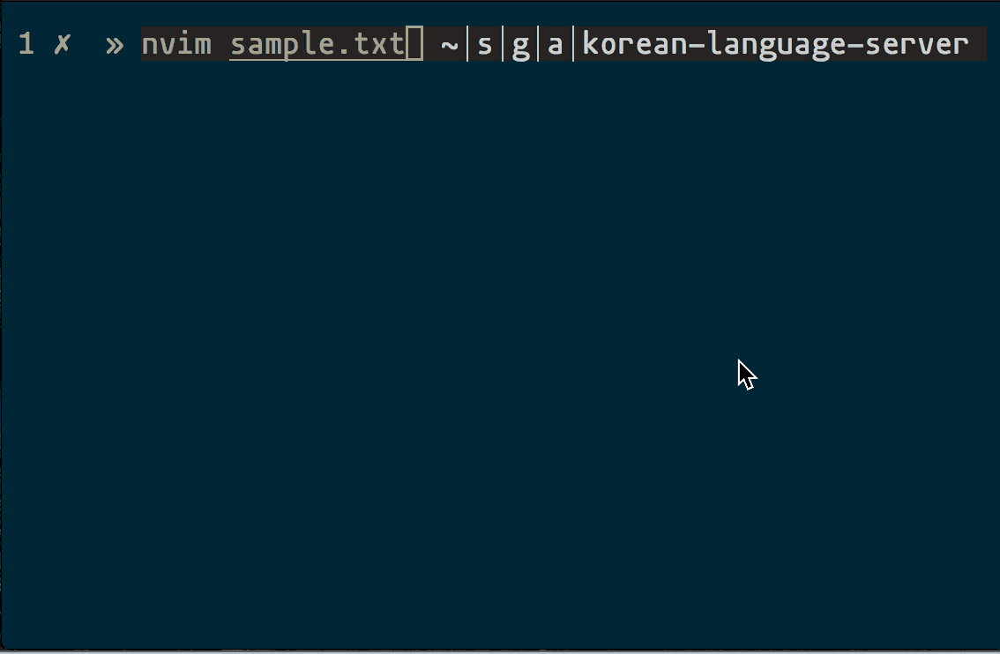

# korean-language-server
[Language server implementation](https://microsoft.github.io/language-server-protocol/) for Korean,
powered by [한국어 맞춤법/문법 검사기](https://speller.cs.pusan.ac.kr/).  

It's Korean version of [grammarly](http://www.grammarly.com/), famous writing assitant app for English.  
As grammarly does, it detects Korean grammar error, also supports code action. It also supports some level of english.



---


### Installation
```
npm i -g korean-ls
```

### Development
```
git clone git@github.com:aca/korean-language-server.git && cd korean-language-server 
npm run build
npm link
```
---
### Integration

Should work with any client implementation, vscode/emacs/sublime/vim.

- vim/neovim, [ coc.nvim ](https://github.com/neoclide/coc.nvim)
  ```
  "languageserver": {
    "korean": {
      "command": "korean-ls",
      "args": ["--stdio"],
      "filetypes": ["text"]
    },
  ```
- nvim-lsp
  ```
  configs.korean_ls = {
    default_config = {
      cmd = {'korean-ls', '--stdio'};
      filetypes = {'text'};
      root_dir = function()
        return vim.loop.cwd()
      end;
      settings = {};
    };
  }
  nvim_lsp.korean_ls.setup{
    on_attach = on_attach;
  }
  ```
